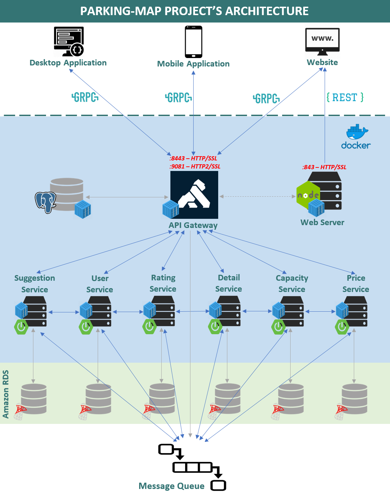

#Parking Map - Final Project - FIT.HCMUS 
<pre>
______               _     _                  ___  ___                        ________
| ___ \             | |   (_)                 |  \/  |                       //  || \ \
| |_/ /  __ _  _ __ | | __ _  _ __    __ _    | .  . |  __ _  _ __     _____//___||__\ \___
|  __/  / _` || '__|| |/ /| || '_ \  / _` |   | |\/| | / _` || '_ \    )  _           _    \
| |    | (_| || |   |   < | || | | || (_| |   | |  | || (_| || |_) |   |_/ \_________/ \___|
\_|     \__,_||_|   |_|\_\|_||_| |_| \__, |   \_|  |_/ \__,_|| .__/   ___\_/_________\_/______
                                      __/ |                  | |
                                     |___/                   |_|  Version:1.0 - ©Copyright 2020
</pre>
#Project's members:
<h6>1. 1653005 - Vu Tuong Bach - 1653005@student.hcmus.edu.vn</h6>
<h6>2. 1653006 - Huynh Thanh Binh - 1653006@student.hcmus.edu.vn</h6>
<h6>3. 1653012 - Pham Viet Minh Dao - 1653012@student.hcmus.edu.vn</h6>
<h6>4. 1653020 - Vu Hai - 1653020@student.hcmus.edu.vn</h6>
<h6>5. 1653076 - Dang Duc Tai - 1653076@student.hcmus.edu.vn</h6>
 

