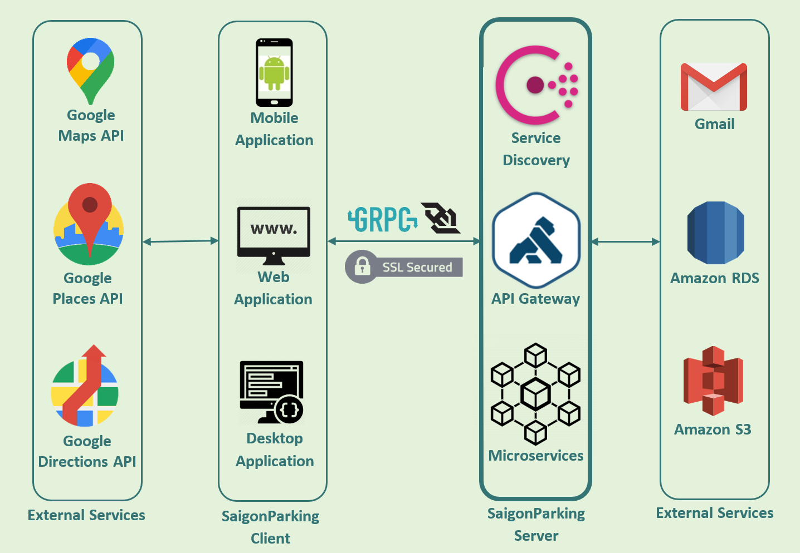
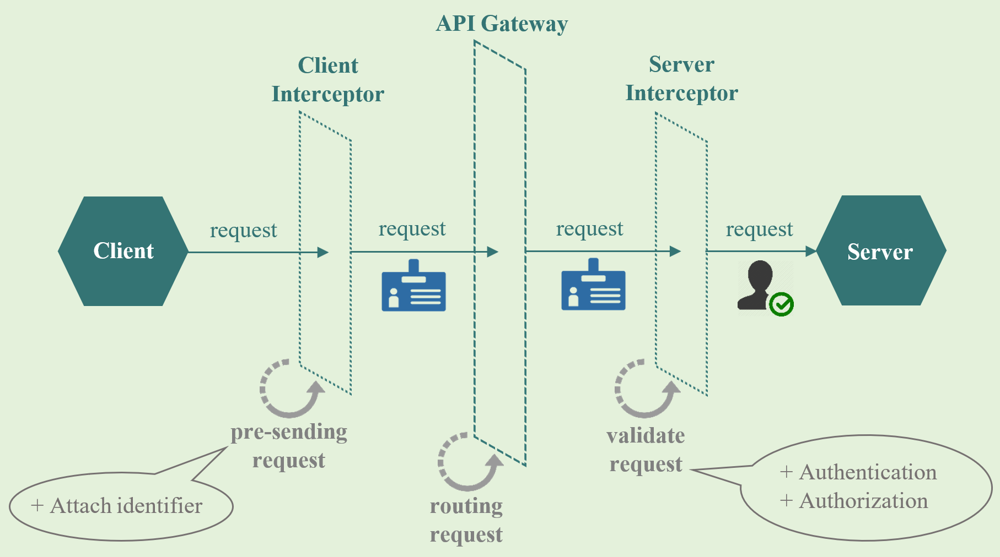
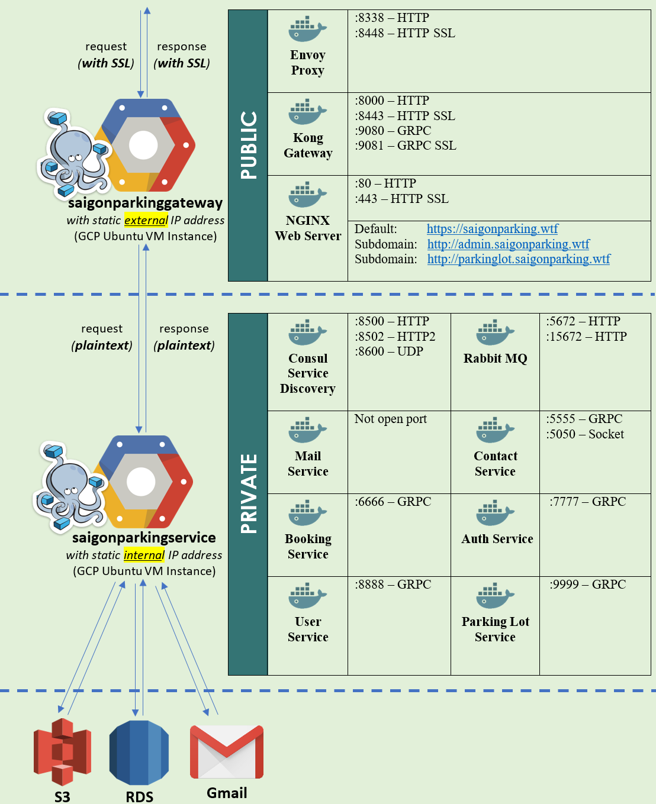
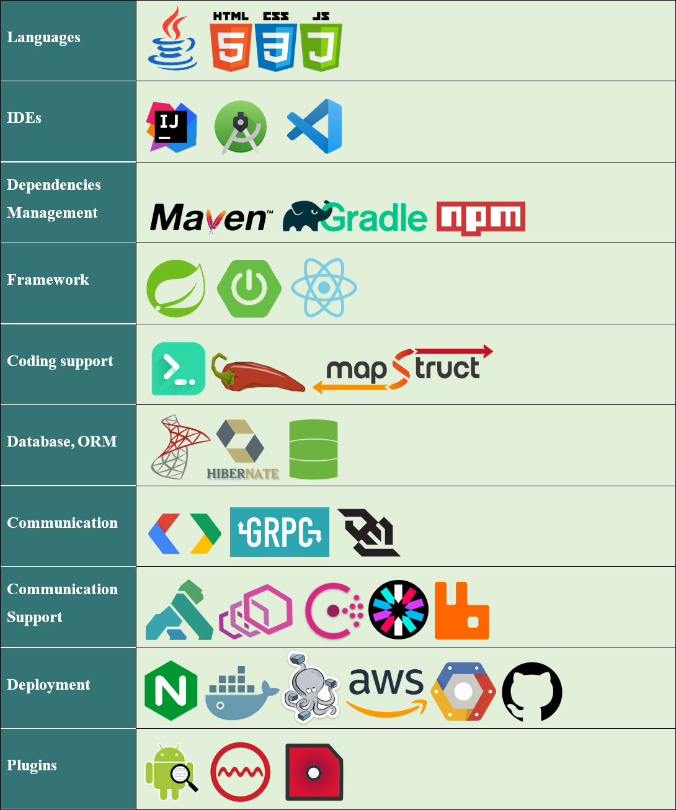

<h2>saigonparking©2020 - graduate thesis - fit@hcmus</h2>
<pre>
 _____         _                        ______              _     _                         ________
/  ___|       (_)                       | ___ \            | |   (_)                       //  ||  \\
\ `--.   __ _  _   __ _   ___   _ __    | |_/ / __ _  _ __ | | __ _  _ __    __ _    _____//___||___\\___
 `--. \ / _` || | / _` | / _ \ | '_ \   |  __/ / _` || '__|| |/ /| || '_ \  / _` |   )  _           _    \
/\__/ /| (_| || || (_| || (_) || | | |  | |   | (_| || |   |   < | || | | || (_| |   |_/ \_________/ \___|
\____/  \__,_||_| \__, | \___/ |_| |_|  \_|    \__,_||_|   |_|\_\|_||_| |_| \__, | ____\_/_________\_/_____
                   __/ |                                                     __/ |
                  |___/                                                     |___/   v2.5 - ©Copyright 2020
</pre>

<h2>0. Project's modules:</h2>
<table>
<tbody>
  <tr>
    <td>1</td>
    <td>saigonparking-backend</td>
    <td>https://github.com/huynhthanhbinh/saigonparking</td>
  </tr>
  <tr>
    <td>2</td>
    <td>saigonparking-webserver</td>
    <td>https://github.com/huynhthanhbinh/saigonparking-web</td>
  </tr>
  <tr>
    <td>3</td>
    <td>saigonparking-android</td>
    <td>https://github.com/huynhthanhbinh/saigonparking-android</td>
  </tr>
  <tr>
    <td>4</td>
    <td>saigonparking-qrscanner</td>
    <td>https://github.com/huynhthanhbinh/saigonparking-qrscanner</td>
  </tr>
</tbody>
</table>

 
<h2>1. Project's members:</h2>
<table>
<tbody>
  <tr>
    <td>1</td>
    <td>1653005</td>
    <td>Vu Tuong Bach</td>
    <td>1653005@student.hcmus.edu.vn</td>
  </tr>
  <tr>
    <td>2</td>
    <td>1653006</td>
    <td>Huynh Thanh Binh</td>
    <td>1653006@student.hcmus.edu.vn</td>
  </tr>
  <tr>
    <td>3</td>
    <td>1653012</td>
    <td>Pham Viet Minh Dao</td>
    <td>1653012@student.hcmus.edu.vn</td>
  </tr>
  <tr>
    <td>4</td>
    <td>1653020</td>
    <td>Vu Hai</td>
    <td>1653020@student.hcmus.edu.vn</td>
  </tr>
  <tr>
    <td>5</td>
    <td>1653076</td>
    <td>Dang Duc Tai</td>
    <td>1653076@student.hcmus.edu.vn</td>
  </tr>
</tbody>
</table>

 
<h2>2. Project's workflow:</h2>

 
<h2>3. Project's architecture:</h2>

 
<h2>4. Authentication &#38; Authorization:</h2>

 
<h2>5. Project's deployment:</h2>

 
<h2>6. Project's technology stack:</h2>

