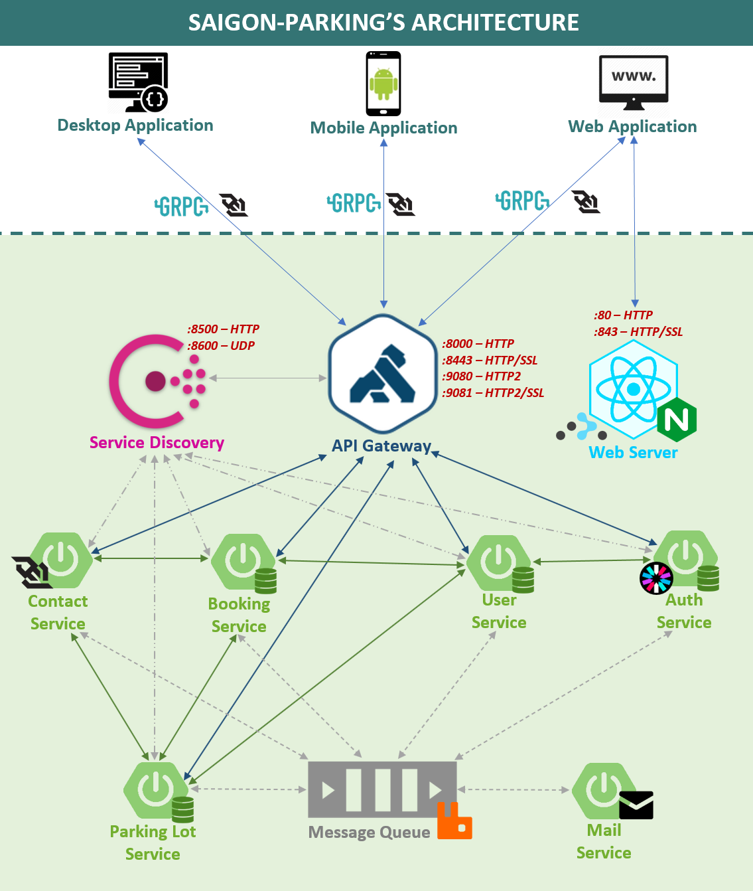

#Saigon Parking - Final Project - FIT.HCMUS 
<pre>
 _____         _                        ______              _     _                         ________
/  ___|       (_)                       | ___ \            | |   (_)                       //  ||  \\
\ `--.   __ _  _   __ _   ___   _ __    | |_/ / __ _  _ __ | | __ _  _ __    __ _    _____//___||___\\___
 `--. \ / _` || | / _` | / _ \ | '_ \   |  __/ / _` || '__|| |/ /| || '_ \  / _` |   )  _           _    \
/\__/ /| (_| || || (_| || (_) || | | |  | |   | (_| || |   |   < | || | | || (_| |   |_/ \_________/ \___|
\____/  \__,_||_| \__, | \___/ |_| |_|  \_|    \__,_||_|   |_|\_\|_||_| |_| \__, | ____\_/_________\_/_____
                   __/ |                                                     __/ |
                  |___/                                                     |___/   v2.3.5 - ©Copyright 2020
</pre>
#Project's members:
<h6>1. 1653005 - Vu Tuong Bach - 1653005@student.hcmus.edu.vn</h6>
<h6>2. 1653006 - Huynh Thanh Binh - 1653006@student.hcmus.edu.vn</h6>
<h6>3. 1653012 - Pham Viet Minh Dao - 1653012@student.hcmus.edu.vn</h6>
<h6>4. 1653020 - Vu Hai - 1653020@student.hcmus.edu.vn</h6>
<h6>5. 1653076 - Dang Duc Tai - 1653076@student.hcmus.edu.vn</h6>
 

