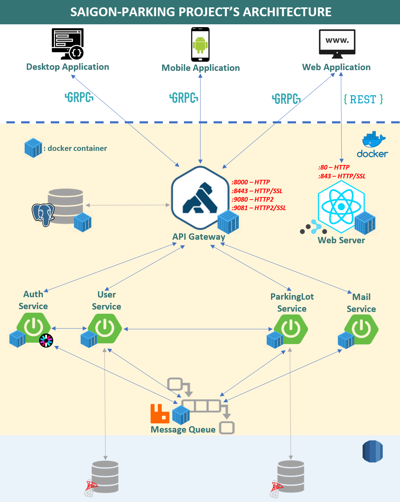

<h2>Run SaigonParking environment</h2>
Written by: Huynh Thanh Binh (bht) in May 20th, 2020 
<h4>Some useful thing to work with saigonparking environment  </h4>

- Start docker compose:
     &emsp;&emsp; $ docker-compose up

- Stop docker compose:
     &emsp;&emsp; Ctrl + C
    
- Remove all containers:
     &emsp;&emsp; $ docker-compose rm
    
<h4>Another frequently used command</h4>
(Can be found in documents folder, file commands.txt)

<h4>Project's architecture</h4>
